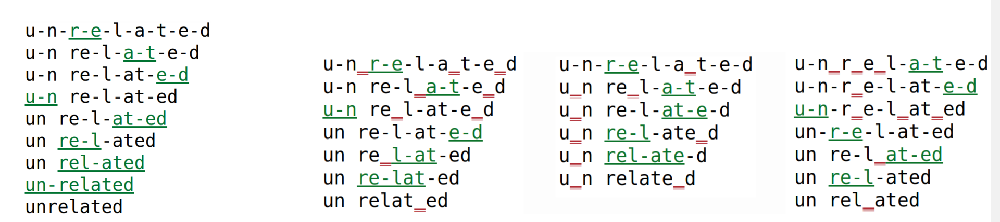

# VOLT-Blog-Final-Version
In this blog, I will be discussing the paper "Vocabulary Leaning via Optimal Transport for Neural Machine Translation". More specifically, I will introduce the concepts discussed in the paper at an introductory level, I will highlight the importance of the question the paper is trying to answer, discuss how it answers that question, and provide examples and benchmarks to aid the understanding of the reader.

Reading time : About 10 minutes

Paper: https://arxiv.org/pdf/2012.15671.pdf

Github: https://github.com/Jingjing-NLP/VOLT

## Introduction

At its core, the paper aims to find a way to reduce resource consumption and computational times of machine translation algorithms. A key part of translating between one language and another is taking the text in the original language and breaking down into tokens to make the translation possible. Tokens are just key elements of the text, they can be words, characters, or even sub-words. A sub-word is just a part of a word. For instance, a sub-word for both the words "lower" and "lowly" could be "low". The set of tokens that get produced from a piece of text is called a token vocabulary. For example, a possible token vocabulary for the sentence "John kicked the soccer ball" would be {kicked, soccer, ball}. VOLT tries to optimize the creation of this token vocabulary by having a noticeable reduction in the size of the token vocabulary produced from a piece of text

VOLT has other advantages other than reducing the vocabulary size. Firstly, VOLT does not only reduce size but produces an overall better vocabulary than current methods. We will see performance metrics later that show this off. Secondly, VOLT works well on multilingual MT settings. This means that VOLT performs better on a more diverse range of languages than other methods such as Byte-Pair Encoding (BPE). Lastly, VOLT uses less resources and computational time than current prevailing methods. For instance, on English to German translation, VOLT uses 30 GPU hours while conventional methods such as BPE-Search take 384 GPU hours. This is because VOLT does not require trail training when it comes to computing the optimal vocabulary. Trail training just means having to iterate through all possible vocabulary sizes to find the best vocabulary at the best size, this methodology is extremely inefficient and so its use is avoided in VOLT. 

The question to now be asked is why is VOLT so important. Why do we need to reduce vocabulary size in the first place? In this next section, we will discuss the current issues with other tokenization methods and why VOLT is necessary

## Issues with current tokenization models

Most current translation models use word-level vocabularies. An issue with this is that word-level vocabularies fail when it comes to handling rare words under limited vocabulary sizes. More recent research suggests the use of character level, sub-word level, or byte level token vocabularies.  Sub-word vocabularies can be seen as a middle ground between character level encodings and byte-level encodings and is used by the byte-pair encoding method. Using a sub-word level encoding can help decrease the sparsity of tokens and increase the shared feature of similar words. My previous example of taking “low” from “lowly” and “lower” previews how we can have these shared features between words. Furthermore, sub-level vocabularies tend to have shorter sentence lengths and no rare words compares to character level vocabularies.

Sub-word vocabularies seem great, but the issue lies with the methods the use them. Here is an example of an analysis on piece of text done by BPE.

BPE works by merging frequent character sequences to make sub-words for the token vocabulary. In the above image. A hyphen is placed in every position there is a possible merge of multiple characters into a sub-word. Nonetheless, our concern here is not how BPE works but the fact that its analysis focuses on how often a character sequence occurs and merges frequent character sequences together. However, BPE does not take into account any of the features of the resulting vocabulary.   

In general, current sub-word approaches tend to consider how often a word occurs in the text but do not consider how large the resulting token vocabulary is going to be. In other words, they consider frequency but not vocabulary size. This means that finding a proper vocabulary size requires trail training, which as discussed earlier, is extremely inefficient. VOLT attempts to fix this issue by considering both word frequency and resulting vocabulary size when attempting to formulate a token vocabulary for a piece of text.  As we will see, formulating a method that considers both vocab size and frequency is quite difficult. In this next section, we will discuss how VOLT manages to achieve this. 

## Techniques of VOLT

There are two main reasons why coming up with a method that considers both frequency and size is difficult. Firstly, the relative frequency of our tokens tends to decrease as our vocabulary size increases which helps our model learn as we have less redundancy. However, having too large of a vocabulary size may cause the opposite problem where the tokens are too sparse which might result in a decrease in the model’s ability to learn. Secondly, the search space of all possible vocabulary sizes is exponential, and as we discussed earlier, we will not be using trail training. This means we must come up with a more efficient way to find the optimal size in exponentially many possible sizes.

To attempt to optimize both entropy (frequency) and size, we come up with the idea of the Marginal Utility of Vocabularization (MUV). In economics, marginal utility is the amount of satisfaction a consumer attains from consuming a unit of a product. It is used to balance between the benefit and the cost, and so here we use the same concept to balance entropy and vocabulary size. Intuitively, we define MUV as the negative derivative of entropy with respect to size. The negative is placed there because as discussed earlier vocabulary size and entropy are roughly inversely proportional to one another, so as size increases, entropy decreases. Initial results show that the usage of MUV has a correlation with two-thirds of tasks performed. Let’s now take a look at a few figures to clarify the points being made here.

