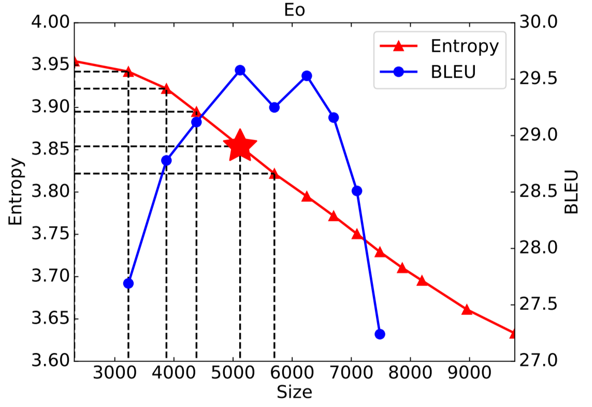
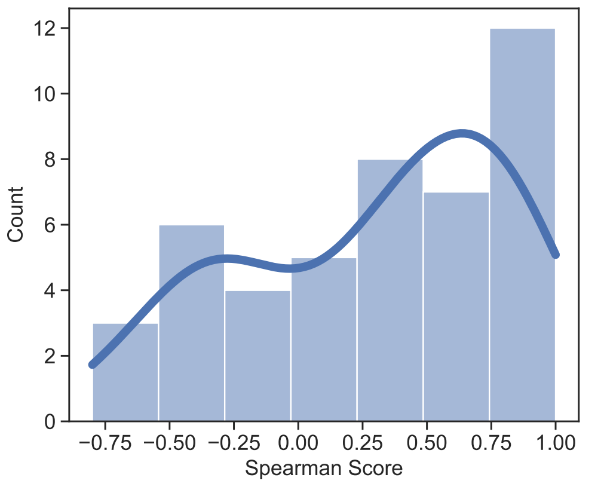
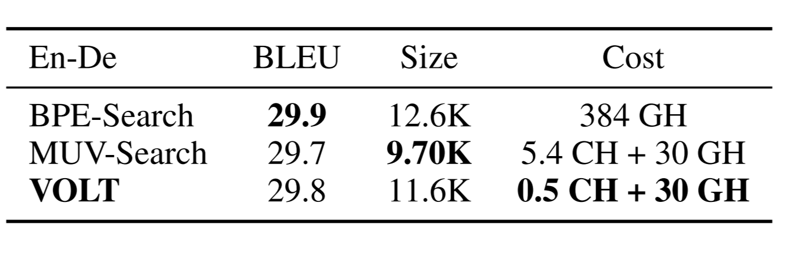
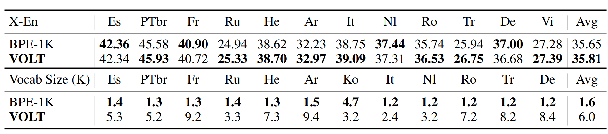

In this blog, I will be discussing the paper "Vocabulary Leaning via Optimal Transport for Neural Machine Translation". More specifically, I will introduce the concepts discussed in the paper at an introductory level, I will highlight the importance of the question the paper is trying to answer, discuss how it answers that question, and provide examples and benchmarks to aid the understanding of the reader.

Reading time: About 8 minutes

Paper: https://arxiv.org/pdf/2012.15671.pdf

Github: https://github.com/Jingjing-NLP/VOLT

## Introduction

At its core, the paper aims to find a way to reduce resource consumption and computational times of machine translation algorithms. The method we will explore today could result in machine translation models running much faster on machines with much less computational power than what is required now. A key part of translating between one language and another is taking the text in the original language and breaking it down into tokens to make the translation process much simpler by using the tokens as a foundation of words or characters to use in the translation. Tokens are just key elements of the text, they can be words, characters, or even sub-words. A sub-word is just a part of a word. For instance, a sub-word for both the words "lower" and "lowly" could be "low". The set of tokens that get produced from a piece of text is called a token vocabulary. Here is an example of a sentence and some possible token vocabulaies from that sentence. 

"John kicked the soccer ball across the field" 
{John, kicked, the soccer, ball, across, the field}. 
{John, kick, ed, the, soccer, ba, ll, a, cross, the, field}
{J,o,h,n,k,i,c,k,e,d,t,h,e,s,o,c,c,e,r,b,a,l,l,a,....,l,d}

VOLT tries to optimize the creation of this token vocabulary by having a noticeable reduction in the size of the token vocabulary produced from a piece of text.

VOLT has other advantages other than reducing the vocabulary size. Firstly, VOLT does not only reduce size but produces an overall better vocabulary than current methods. We will see performance metrics later that show this off. Secondly, VOLT works well on multilingual MT settings. This means that VOLT performs better on a more diverse range of languages than other methods such as Byte-Pair Encoding (BPE) [1]. Lastly, VOLT uses less resources and computational time than current prevailing methods. For instance, on English to German translation, VOLT uses 30 GPU hours while conventional methods such as BPE-Search take 384 GPU hours. This is because VOLT does not require trail training when it comes to computing the optimal vocabulary. Trail training just means having to iterate through all possible vocabulary sizes to find the best vocabulary at the best size, this methodology is extremely inefficient and so its use is avoided in VOLT. 

The question to now be asked is why VOLT is so important. Why do we need to reduce vocabulary size in the first place? In this next section, we will discuss the current issues with other tokenization methods and why VOLT is necessary.

## Issues with current tokenization models

Most current translation models use word-level vocabularies. An issue with this is that word-level vocabularies fail when it comes to handling rare words under limited vocabulary sizes. More recent research suggests the use of character level, sub-word level, or byte level token vocabularies.  Sub-word vocabularies can be seen as a middle ground between character level encodings and byte-level encodings and is used by the byte-pair encoding method. Using a sub-word level encoding can help decrease the sparsity of tokens and increase the shared feature of similar words. My previous example of taking “low” from “lowly” and “lower” previews how we can have these shared features between words. Furthermore, sub-level vocabularies tend to have shorter sentence lengths and no rare words compares to character level vocabularies.

Sub-word vocabularies seem great, but the issue lies with the methods the use them. Here is an example of an analysis on piece of text done by BPE.

BPE works by merging frequent character sequences to make sub-words for the token vocabulary. In the above image. A hyphen is placed in every position there is a possible merge of multiple characters into a sub-word. Nonetheless, our concern here is not how BPE works but the fact that its analysis focuses on how often a character sequence occurs and merges frequent character sequences together. However, BPE does not take into account any of the features of the resulting vocabulary.   

In general, current sub-word approaches tend to consider how often a word occurs in the text but do not consider how large the resulting token vocabulary is going to be. In other words, they consider frequency but not vocabulary size. This means that finding a proper vocabulary size requires trail training, which as discussed earlier, is extremely inefficient. VOLT attempts to fix this issue by considering both word frequency and resulting vocabulary size when attempting to formulate a token vocabulary for a piece of text.  As we will see, formulating a method that considers both vocab size and frequency is quite difficult. In this next section, we will discuss how VOLT manages to achieve this. 

## Techniques of VOLT

There are two main reasons why coming up with a method that considers both frequency and size is difficult. Firstly, the relative frequency of our tokens tends to decrease as our vocabulary size increases which helps our model learn as we have less redundancy. However, having too large of a vocabulary size may cause the opposite problem where the tokens are too sparse which might result in a decrease in the model’s ability to learn. Secondly, the search space of all possible vocabulary sizes is exponential, and as we discussed earlier, we will not be using trail training. This means we must come up with a more efficient way to find the optimal size in exponentially many possible sizes.

To attempt to optimize both entropy (frequency) and size, we come up with the idea of the Marginal Utility of Vocabularization (MUV). In economics, marginal utility is the amount of satisfaction a consumer attains from consuming a unit of a product. It is used to balance between the benefit and the cost, and so here we use the same concept to balance entropy and vocabulary size. Intuitively, we define MUV as the negative derivative of entropy with respect to size. The negative is placed there because as discussed earlier vocabulary size and entropy are roughly inversely proportional to one another, so as size increases, entropy decreases. Initial results show that the usage of MUV has a correlation with two-thirds of tasks performed. Let’s now look at a few figures to clarify the points being made here.

Firstly, it’s helpful to understand that BLEU and Spearman score are just two performance metrics and not knowing the details of how they work does not affect one’s ability to understand these figures. In the first model, we have entropy on the y-axis and size on the x-axis. Notice the roughly inversely proportional relationship between them. The BLEU score is also graphed, and a star is placed at the vocabulary with highest MUV. Notice that the starred vocabulary is the one corresponding to the vocabulary with the highest BLEU score, meaning it is the best performing vocabulary. 

For the second figure, experiments were conducted on 45 language pairs and the spearman score between MUV and BLEU were recorded for each pair. Spearman score here is just a correlation score where the higher the correlation between MUV and performance, the higher the spearman score. The figure shows the results with the spearman score on the x-axis and the number of generated vocabularies that correspond to a certain spearman score range on the y-axis. The results show that for two-thirds of the generated vocabularies there is a positive spearman score indicating a correlation between MUV and performance.

## Effectiveness of VOLT

The experiments shown here are conducted from one of the three following datasets. The WMT-14 English-German dataset which has 4.5 M English-German sentence pairs. The TED bilingual dataset where we chose 12 different language pairs that had the most training data. Lastly, the TED multilingual dataset where we chose 52 language pairs on a many-to English setting. 
Here are some of the main advantages of VOLT:
### 1.	Overall better performance than widely used vocabularies

In a paper by Shuoyang Ding [2], it was found that among the 42 papers accepted for the Conference of Machine Translation, the most common size was 30K-40K. Hence, we compare VOLT’s BLEU (performance) scores with a popular method such as Byte Pair Encoding with a 30K vocabulary size. Here are the results:

The first set of rows compares BPE-30K with VOLT on English to other language tasks, while the second set of rows compares BPE-30K with VOLT on other language to English tasks, and the last row of columns shows off the size difference in the vocabularies generated during these tasks. It is clear to see that VOLT outperforms BOE-30K in almost every task on every language and more importantly, produces vocabularies that are much smaller in size than BPE-30K generated vocabularies. 

### 2. Low Resource Consumption

To explore VOLT’s resource consumption in respect to other methods, we will first run BPE-1K, BPE-2K, BPE-3K, BPE-4K, BPE-5K, BPE-6K, BPE-7K, BPE-8K, BPE-9K, BPE-10K, BPE-20K, and BPE 30K and select the best performing vocabulary out of those produced by these runs. We will cause this method of running several BPE’s and selecting the best one BPE-Search. We will also define another method, which we will call MUV-Search. MUV-Search iterates through various vocabulary sizes and selects the one with highest MUV. Notice that while VOLT also uses MUV, it does not do trail training as it applies constraints on the possible vocabulary sizes and uses transport matrices to find the optimal vocabulary. We compare BPE-Search, MUV-Search, and VOLT and get the following results:

In the table above, GH and CH are GPU Hours and CPU Hours respectively. The results seem to indicate that the performance score of all 3 is extremely similar. However, MUV-Search produces a smaller vocabulary than BPE-Search and generates this vocabulary in 348.6 less computing hours. VOLT seems to be an even better option as it produces a vocabulary also smaller than BPE-Search and it does so 5 computing hours quicker than MUV-Search.

### 3.	Versatile, better on a large array of languages

To test how good VOLT is across as many languages as possible. We conduct experiments to compare VOLT to BPE-60K as that it the most popular size setting for multi-lingual translation tasks. Here are the results:

The table shows results for BPE-60K and VOLT on 52 different languages to English translation tasks. VOLT performs better than BPE-60K on 42 of those languages which shows how versatile VOLT is.

## Summary

A key part of machine translation is the process of tokenization. For one language to be translated to another, we must extract all the key elements of the source language text such as words and characters and use those to translate the text to another language. Traditionally, tokenization methods tend to focus on how frequently a word or character pair occurs to decide whether to make it a token. However, these methods do not consider how big the token set is going to end up being, which also affects the performance of the resulting token set on translation tasks. The method introduced in this paper, VOLT, takes into account both word frequency and size to produce better performing token sets. In addition, VOLT does not iterate through all possible sizes to find the best one; instead, it treats the problem as an optimal transport matrix. This means it applies constraints on the possible optimal sizes and utilizes transport matrices to come up with the optimal size. VOLT is an important method when it comes future machine translation models as it could result in faster training times and better performance all in less computing hours.

## References
[1] Sennrich, Haddow, et al. “Neural machine translation of rare words with subword units.” In Proceedings of the 54th Annual Meeting of the Association for Computational Linguistics, ACL 2016, August 7-12, 2016, Berlin, Germany, Volume 1: Long Papers. The Association for Computer Linguistics

[2] Ding, Renduchintala, et al.  “A call for prudent choice of subword merge operations in neural machine translation.” In Proceedings of Machine Translation Summit XVII Volume 1: Research Track, MTSummit 2019, Dublin, Ireland, August 19-23, 2019, pages 204– 213. European Association for Machine Translation.
